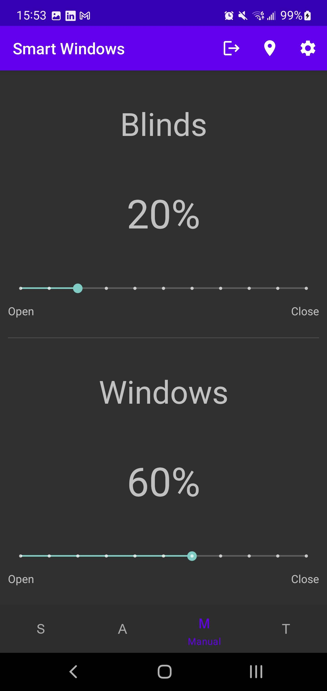
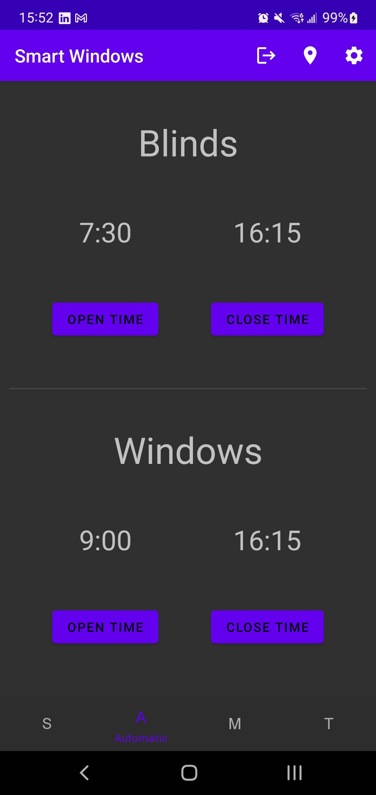
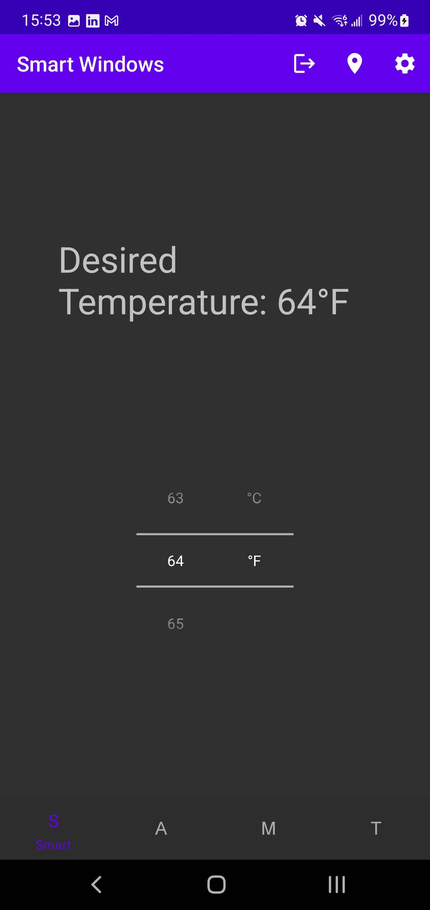
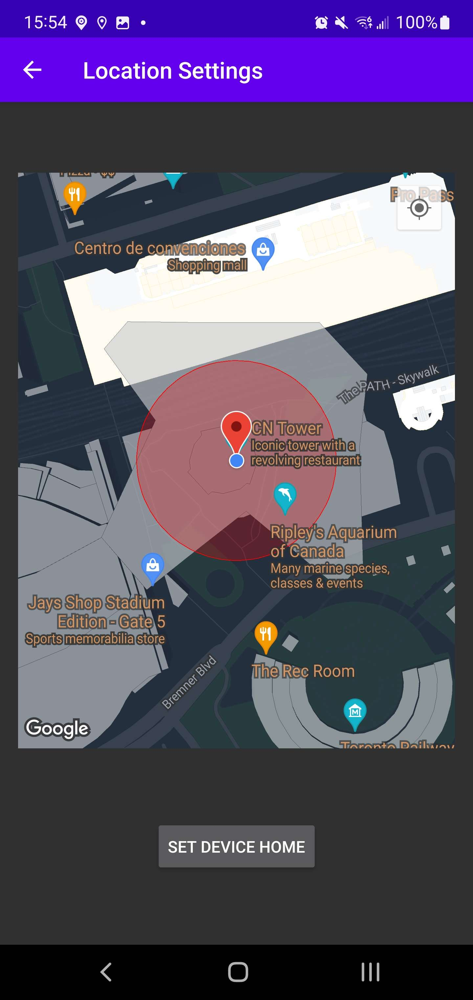

# Smart Windows Raspberry Pi Project

Introducing the Smart Windows Raspberry Pi Project, where you can take charge of your window and blind operations with ease. This innovative project, controlled through an Android application powered by Firebase, offers three distinct modes: Manual, Smart, and Automatic. In Manual mode, you have the flexibility to control your blinds and windows in precise 10% increments, allowing for customized lighting and privacy adjustments. Additionally, the project offers Smart mode, which utilizes various sensors, and Automatic mode for time-based scheduling. The Android app even employs geofencing to automatically close windows when you're out of the house, ensuring energy savings and security. Explore the possibilities of smart window management with this exciting project!

## Features

- **Manual Mode:**

  - Take direct control of your windows with manual adjustments through the Android app.

- **Automatic Mode:**

  - Set up time-based schedules to automate window operations according to your preferences.

- **Smart Mode:**

  - Utilize a combination of light, rain, and temperature sensors to intelligently determine when windows should be opened or closed.

- **Geofencing:**

  - The Android app uses geofencing to detect when you leave the house, automatically closing windows for security and energy savings.

## Demo Video

[Click Here to Watch the Demonstration Video on Youtube](https://www.youtube.com/watch?v=4RYRujc7fvM)

## Android Application Screenshots

### Manual

### Automatic

### Smart

### Geofence (One-Click Setup)

## Technologies Used

- **Raspberry Pi:** The core of the system, controlling window operations.
- **Embedded Systems:** Includes sensors, linear actuator, and stepper motor.
- **Android Application:** Firebase-powered app for remote control and automation.
- **Firebase:** Cloud-based backend for real-time data synchronization and geofencing.
- **Geofencing:** Ensures windows are closed when users leave home.

## Reports and Documentation

### Final Report

[Click to view the final report](./documentation/Capstone%20Final%20Report.pdf)

### Final Showcase Abstract

[Click to view the abstract](./documentation/Abstract.pdf)

### Final Showcase Poster

[Click to view the poster](./documentation/MSE%20Poster%20Template.pdf)

## License

This project is licensed under the [MIT License](https://opensource.org/licenses/MIT).

## Contact

If you have any questions or suggestions, please feel free to reach out:

- Email: kpirabaharan3@gmail.com
- LinkedIn: [https://linkedin.com/in/kpirabaharan/](https://linkedin.com/in/kpirabaharan/)
